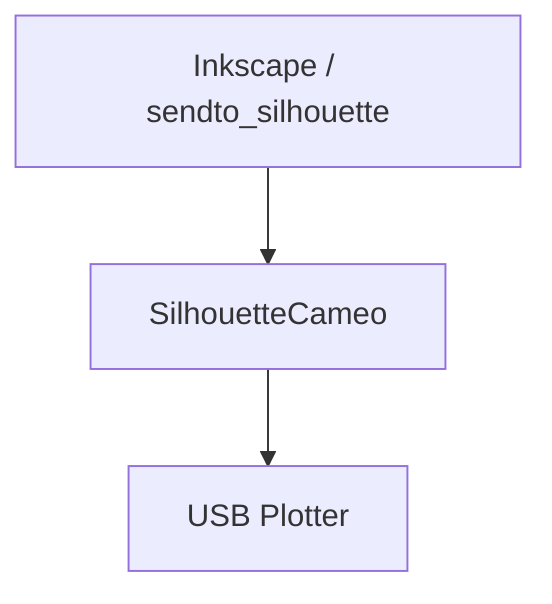
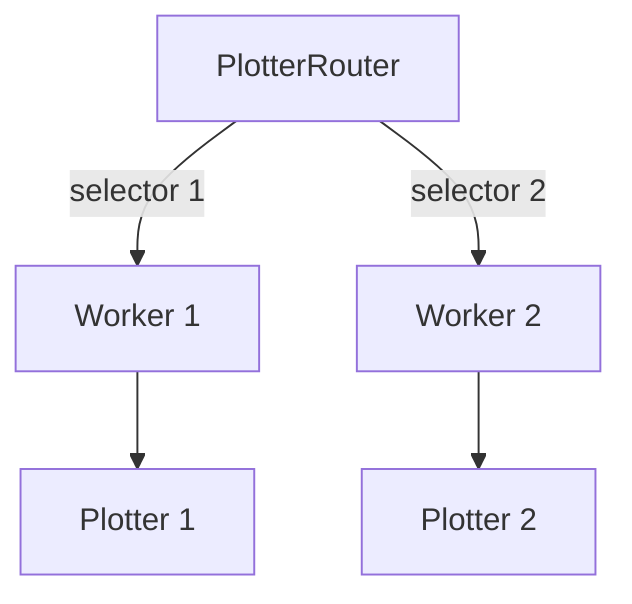

# Диаграммы архитектуры

## Текущее состояние

```mermaid
graph TD
    A[Inkscape / sendto_silhouette] --> B[SilhouetteCameo]
    B --> C[USB Plotter]
```

## Целевое состояние (несколько устройств)

```mermaid
graph TD
    R[PlotterRouter]
    R -->|selector 1| W1[Worker 1]
    R -->|selector 2| W2[Worker 2]
    W1 --> P1[Plotter 1]
    W2 --> P2[Plotter 2]
```

